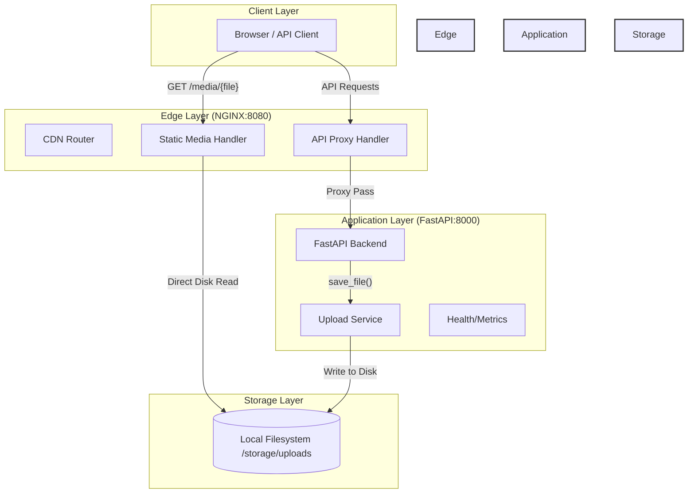

# Media CDN Platform

A production-grade Media Content Delivery Network (CDN) platform designed for high-performance file uploads and edge-optimized delivery. This solution leverages **NGINX** as a high-speed static file server and **FastAPI** as a robust application backend.

## 🏗 Architecture

The platform follows a classic **Edge/Origin** architecture where NGINX acts as the intelligent edge layer, serving cached/static media directly from disk while proxying dynamic API requests to the origin backend.



### Key Design Decisions
- **Static CDN Mode**: NGINX serves media directly from the filesystem. This bypasses the Python interpreter entirely for binary delivery, ensuring ultra-low latency and maximum concurrency.
- **Unified Storage Volume**: A shared Docker volume between NGINX and the Backend ensures that uploaded files are immediately available for serving at the edge.
- **Edge Caching Headers**: NGINX is configured to inject immutable cache headers for media assets, allowing browsers and downstream CDNs to cache content for up to 1 year.

---

## 🚀 Features

- ✅ **High-Performance Delivery**: Minimal overhead via NGINX `alias` serving.
- ✅ **Edge Caching**: Pre-configured `Cache-Control` headers for optimal browser behavior.
- ✅ **Deterministic 404s**: No phantom caching of failed requests.
- ✅ **DevOps Friendly**: Fully containerized with Docker Compose.
- ✅ **API First**: Clean FastAPI backend with automatic Swagger/ReDoc documentation.

---

## 🛠 Tech Stack

- **Edge Proxy**: NGINX (latest)
- **Backend**: FastAPI (Python 3.12)
- **Process Manager**: Gunicorn (Uvicorn Workers)
- **Containerization**: Docker & Docker Compose
- **Storage**: Local Filesystem (POSIX-compliant)

---

## 📡 API Endpoints

### Media Operations
| Method | Endpoint | Description |
| :--- | :--- | :--- |
| **POST** | `/api/v1/media/upload` | Upload a new media file (Multipart Form) |
| **GET** | `/api/v1/media/` | List all available media files |
| **GET** | `/media/{filename}` | Retrieve a specific media file (Served by NGINX) |

### System Health
| Method | Endpoint | Description |
| :--- | :--- | :--- |
| **GET** | `/api/v1/health` | Basic liveness check |
| **GET** | `/api/v1/health/ready`| Readiness check (verifies storage connectivity) |

---

## 📦 Setup & Deployment

1. **Clone and Initialize**:
   ```bash
   git clone <repository-url>
   cd media-cdn-platform
   ```

2.  **Environment Setup**:
    ```bash
    cp .env.example .env
    ```

3. **Start the Platform**:
   ```bash
   docker-compose up --build -d
   ```

### Runtime Configuration (Env-Driven)
- `NGINX_PORT`: Nginx listen/published port (default `8080`)
- `BACKEND_SERVICE`: Upstream backend DNS name for Nginx (default `backend`)
- `BACKEND_PORT`: Backend container port and Nginx upstream port (default `8000`)
- `LOCAL_STORAGE_PATH`: Host upload directory (default `./storage/uploads`)
- `UPLOAD_PATH`: In-container upload directory (default `/app/storage/uploads`)
- `BACKEND_UPLOAD_PATH`: Backend runtime upload path (default `./storage/uploads` for local dev; Compose maps it to `/app/storage/uploads`)

Nginx now uses a template at `nginx/nginx.conf.template`, rendered at container startup with `envsubst`.

---

## 🧪 Usage Examples

### 1. Upload a File
```bash
curl -F "file=@my_image.jpg" http://localhost:8080/api/v1/media/upload
```

### 2. Retrieve Media (Edge)
```bash
curl -I http://localhost:8080/media/my_image.jpg
```
*Observe the `Cache-Control: public, max-age=31536000, immutable` header.*

### 3. Check Health
```bash
curl http://localhost:8080/api/v1/health/ready
```

---

## 🔐 Security Scanning (Trivy)

Trivy is integrated into CI via `.github/workflows/backend-ci.yml` and blocks pull requests/pushes when **HIGH/CRITICAL** issues are found.

### What gets scanned
- Repository filesystem (dependencies, secrets, and IaC/config)
- Built backend container image

### Run locally before deployment
1. Install Trivy: https://trivy.dev/latest/getting-started/installation/
2. Execute the project scan script:
```bash
./scripts/trivy-scan.sh
```

Optional overrides:
```bash
TRIVY_IMAGE_TAG=my-backend:scan TRIVY_SEVERITY=CRITICAL ./scripts/trivy-scan.sh
```
