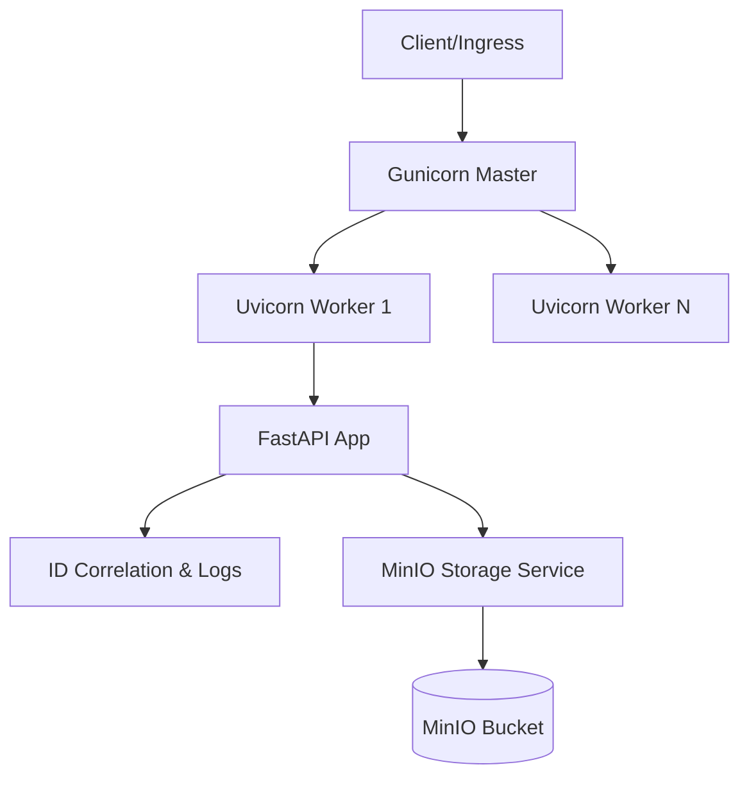

# 🚀 Media CDN Platform

A high-performance, production-ready Media CDN backend built with **FastAPI**, **Gunicorn**, and **MinIO**. Designed for scalability, observability, and extreme reliability.


---

## ✨ Key Features

### ⚡ Performance
- **ORJSON**: High-speed JSON serialization.
- **Multiprocessing**: Gunicorn worker management optimized for CPU core count.
- **Asynchronous**: Fully non-blocking I/O using FastAPI and Starlette.

### 🛡️ Reliability & Security
- **Graceful Shutdown**: Managed lifespan hooks for clean resource cleanup.
- **Dependency Probes**: Advanced `/health/ready` endpoint with real-time MinIO connectivity checks.
- **Global Error Handling**: Centralized exception management to prevent stack trace leaks in production.
- **Docs Gating**: Swagger and ReDoc are automatically disabled in `production` and `staging` environments.

### 📊 Observability
- **Request Correlation**: Automated `X-Request-ID` propagation through middleware.
- **Structured Logging**: JSON-formatted logs for seamless ingestion by ELK, Splunk, or CloudWatch.
- **Context-Aware Logs**: Every log entry automatically includes the unique `request_id`.

---

## 🏗️ Architecture



---

## 🚀 Getting Started

### 1. Prerequisites
- Python 3.10+
- MinIO (Local or Cloud instance)

### 2. Installation
```bash
# Clone the repository
git clone <repo-url>
cd backend

# Create and activate virtual environment
python -m venv .venv
source .venv/bin/activate

# Install dependencies
pip install -r requirements.txt
```

### 3. Configuration
Create a `.env` file based on `.env.example`:
```env
MINIO_ENDPOINT=localhost:9000
MINIO_ACCESS_KEY=minioadmin
MINIO_SECRET_KEY=minioadmin
MINIO_BUCKET=media-cdn
```

### 4. Running the App
**Development:**
```bash
uvicorn app.main:app --reload
```

**Production:**
```bash
gunicorn -c gunicorn_conf.py app.main:app
```

---

## 🛣️ API Endpoints

### 🩺 Health & Monitoring
| Method | Endpoint | Description |
| :--- | :--- | :--- |
| `GET` | `/api/v1/health/` | General service status. |
| `GET` | `/api/v1/health/live` | Liveness probe for orchestrators. |
| `GET` | `/api/v1/health/ready` | Readiness probe (checks MinIO connectivity). |

### 📁 Media Operations
| Method | Endpoint | Description |
| :--- | :--- | :--- |
| `GET` | `/api/v1/media/` | List all objects in the configured bucket. |
| `POST` | `/api/v1/media/upload` | Upload a new media file (multipart/form-data). |

---

## 🧪 Testing
The project uses `pytest` with 100% coverage on core logic and integration points.

```bash
# Run the test suite
PYTHONPATH=. pytest tests/
```

---

## 🛠️ Built With
- **[FastAPI](https://fastapi.tiangolo.com/)**: Modern web framework.
- **[MinIO Python SDK](https://min.io/docs/minio/linux/index.html)**: Object storage client.
- **[Pydantic V2](https://docs.pydantic.dev/)**: Data validation and settings management.
- **[python-json-logger](https://github.com/madzak/python-json-logger)**: Structured logging.